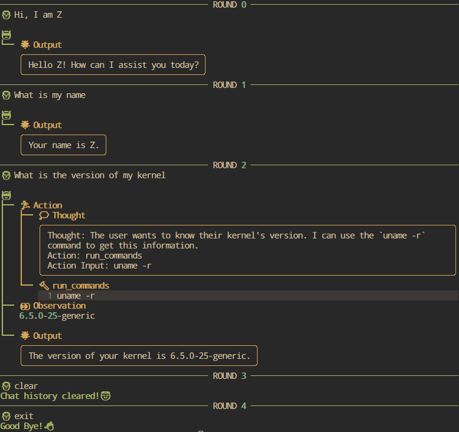

A toy demo to play with **langchain**.

It can generate and execute commands (in **docker** container for safety) from user's natural language.

And it rely on **ollama** to chat with locally deployed LLM (**qwen-14b**).



# Setup
1. Install packages
```bash
pip install -r requirements.txt
```
2. Install and serve docker, ollama
3. Pull the docker image `ubuntu:22.04` and LLM `qwen:14b`

# Usage
Start chat session:
```bash
python main.py
```

Special input seq:
- `clean/clear`: Clear chat history of current session
- `exit/quit/q`: Exit chat session
